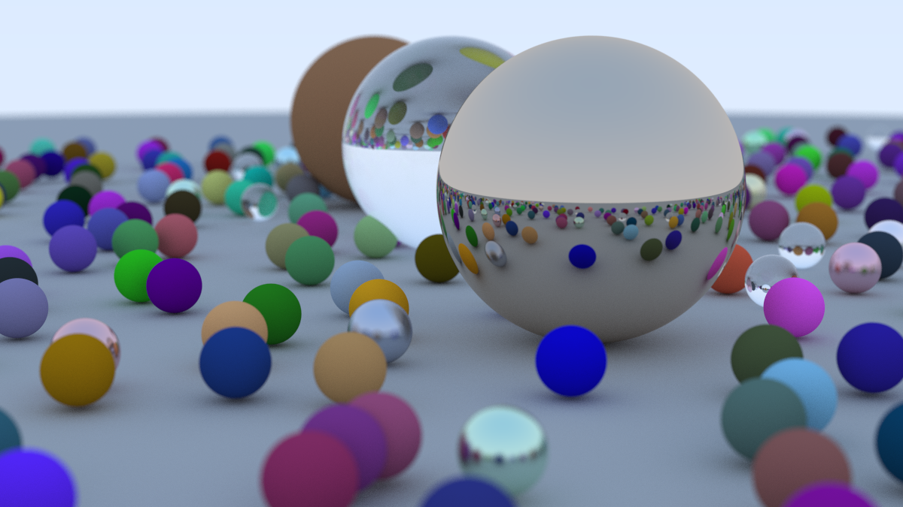

# 🎨 Zharko - a simple ray tracer written in Rust



Hello! This is a simple ray tracer written in Rust for my mathematical modelling course. It is not meant to be
a serious project, I just took the opportunity to combine my course work and my Rust learning journey.

## ✨ Features

- **Progressive Rendering with Progress Bar:** Renders the image sample by sample, providing visual feedback via a progress bar (using the `indicatif` crate). This is useful for long renders.
- **PPM Image Output:** Renders directly to the PPM image format, a simple and portable format for storing images.
- **Configurable Camera:** The camera can be configured with `vfov`, `lookfrom`, `lookat`, `samples_per_pixel`, and `max_depth`.

## 🛠️ Techniques

- **Ray-Sphere Intersection:** Implements the mathematical solution to find where a ray intersects with a sphere, a fundamental operation in ray tracing. This follows standard geometric algorithms.
- **Materials:**
  - **Lambertian Diffuse Reflection:** Simulates matte surfaces using Lambert's cosine law for diffuse reflection. Rays are scattered in random directions weighted by the cosine of the angle between the ray and the surface normal.
  - **Metal Reflection:** Simulates reflective surfaces using vector reflection. Incident rays are reflected across the surface normal.
  - **Dielectric:** Simulates transparent materials like glass that refract and reflect light. It uses Snell's law for refraction and Schlick's approximation for reflectance.
- **Gamma Correction:** Applies gamma correction (square root) to linear color values before output to ensure correct brightness on displays. This is a crucial step in any rendering pipeline.
- **Anti-aliasing (MSAA):** Reduces jagged edges (aliasing) by taking multiple samples per pixel and averaging their colors. This is a form of Multisample Anti-Aliasing (MSAA).
- **Shadow Acne Mitigation:** Prevents visual artifacts by ignoring hits that are too close to the surface.

## 🚀 How to run examples

The individual examples are contained in the `examples/` directory. They can be run with `cargo` like so:

```bash
cargo run --example <example>
```
